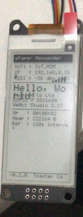
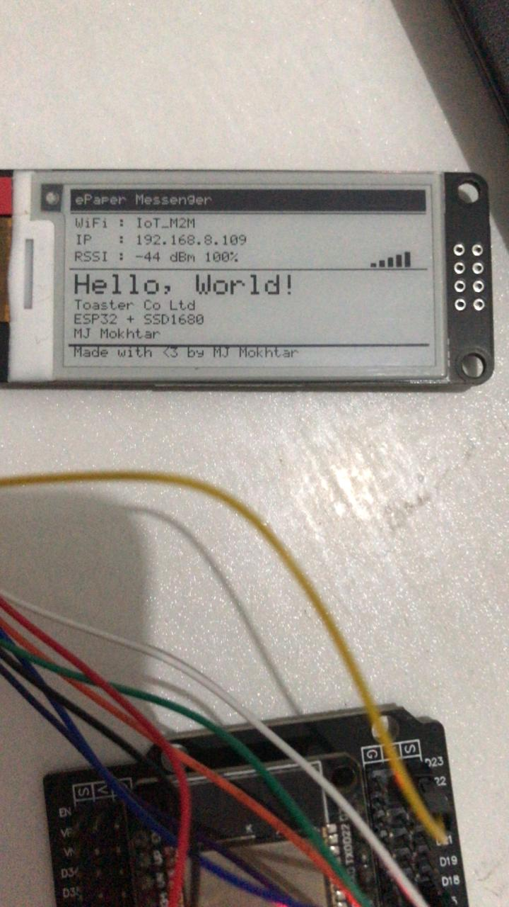

# ePaper Messenger

ESP32 + WeAct Studio 2.13" ePaper display project built with ESP-IDF.  
Menampilkan informasi WiFi, IP, kualitas sinyal, dan system info dalam mode **landscape 250×128**.

---

## Hardware

| Komponen | Detail |
|---|---|
| MCU | ESP32 (any variant) |
| Display | WeAct Studio 2.13" ePaper (SSD1680) |
| Resolusi fisik | 128×250 px |
| Resolusi logika | 250×128 px (landscape) |
| Warna | Hitam & Putih |

### Wiring

| ESP32 GPIO | ePaper Pin | Keterangan |
|---|---|---|
| GPIO 23 | DIN (MOSI) | SPI Data |
| GPIO 18 | CLK (SCK) | SPI Clock |
| GPIO 5 | CS | Chip Select |
| GPIO 17 | DC | Data/Command |
| GPIO 16 | RST | Reset |
| GPIO 4 | BUSY | Busy signal |
| 3.3V | VCC | Power |
| GND | GND | Ground |

> Pin dapat diubah di `components/epaper/epaper.h` bagian `GPIO Pin Assignment`.

---

## Struktur Project

```
epaper_messenger/
│
├── CMakeLists.txt                    ← root build
│
├── main/
│   ├── CMakeLists.txt
│   └── main.c                        ← app_main, WiFi, timer, render
│
└── components/
    ├── epaper/
    │   ├── CMakeLists.txt
    │   ├── epaper.h                  ← API + konfigurasi pin
    │   └── epaper.c                  ← SPI driver, init sequence SSD1680
    │
    └── epaper_gfx/
        ├── CMakeLists.txt
        ├── epaper_gfx.h              ← API shapes, text, bitmap
        └── epaper_gfx.c              ← font 5×7, primitif grafis
```

---

## Konfigurasi

Edit bagian ini di `main/main.c`:

```c
#define WIFI_SSID           "NamaWiFiKamu"
#define WIFI_PASSWORD       "PasswordKamu"
#define WIFI_MAX_RETRY      5
#define REFRESH_INTERVAL_MS (2 * 60 * 1000)   // interval refresh dalam ms
```

Untuk mengubah pin GPIO, edit `components/epaper/epaper.h`:

```c
#define EPD_PIN_MOSI    23
#define EPD_PIN_CLK     18
#define EPD_PIN_CS      5
#define EPD_PIN_DC      17
#define EPD_PIN_RST     16
#define EPD_PIN_BUSY    4
```

---

## Build & Flash

```bash
# Set target
idf.py set-target esp32

# Build
idf.py build

# Flash + monitor
idf.py -p /dev/ttyUSB0 flash monitor
```

---

## Fitur

- **WiFi Station** — connect ke WiFi dengan retry otomatis (max 5x, timeout 10 detik)
- **Layar boot** — tampil "Connecting..." saat WiFi sedang connect
- **Info WiFi** — SSID, IP address, RSSI dalam dBm dan persentase
- **Signal bar** — 5 bar indikator kualitas sinyal seperti indikator HP
- **Refresh periodik** — update RSSI dan render ulang setiap N menit (default 2 menit)
- **System info** — uptime, heap free, interval refresh
- **Deep sleep panel** — setelah render selesai panel masuk deep sleep (<1µA)
- **Landscape mode** — orientasi 250×128 px

---

## GFX API

### Text

```c
// Gambar satu karakter, return x advance
int epd_draw_char(int x, int y, char c, epd_font_t font, uint8_t color);

// Gambar string dengan auto word-wrap dan \n support
// Return Y akhir
int epd_draw_string(int x, int y, const char *str, epd_font_t font, uint8_t color);
```

Font yang tersedia:
```c
FONT_SMALL   // 5×7 px  (1× scale)
FONT_MEDIUM  // 10×14 px (2× scale)
FONT_LARGE   // 15×21 px (3× scale)
```

### Shapes

```c
void epd_draw_hline(int x, int y, int w, uint8_t color);
void epd_draw_vline(int x, int y, int h, uint8_t color);
void epd_draw_line(int x0, int y0, int x1, int y1, uint8_t color);

void epd_draw_rect(int x, int y, int w, int h, uint8_t color);
void epd_fill_rect(int x, int y, int w, int h, uint8_t color);
void epd_draw_round_rect(int x, int y, int w, int h, int r, uint8_t color);
void epd_fill_round_rect(int x, int y, int w, int h, int r, uint8_t color);

void epd_draw_circle(int cx, int cy, int r, uint8_t color);
void epd_fill_circle(int cx, int cy, int r, uint8_t color);

void epd_draw_triangle(int x0, int y0, int x1, int y1, int x2, int y2, uint8_t color);
void epd_fill_triangle(int x0, int y0, int x1, int y1, int x2, int y2, uint8_t color);
```

### Bitmap

```c
// Format: 1bpp MSB-first (cocok dengan export GIMP monochrome)
void epd_draw_bitmap(int x, int y, const uint8_t *bitmap, int w, int h, uint8_t color);
```

### ePaper Core

```c
void epd_init(void);          // init SPI + GPIO + panel, panggil sekali
void epd_clear_buffer(void);  // isi buffer dengan putih
void epd_display(void);       // kirim buffer ke panel + trigger refresh (~2-8 detik)
void epd_clear_screen(void);  // clear + display sekaligus
void epd_sleep(void);         // panel deep sleep <1µA
void epd_wake(void);          // bangunkan panel (hw reset + init ulang)
void epd_draw_pixel(int x, int y, uint8_t color); // set pixel di buffer
uint8_t *epd_get_buffer(void);  // akses langsung ke framebuffer
```

---

## Catatan Teknis

### Mengapa `epd_display()` lama?

SSD1680 melakukan full refresh yang menggerakkan partikel tinta secara fisik. Proses ini membutuhkan ~2–8 detik dan tidak bisa dipercepat. Ini adalah karakteristik hardware ePaper, bukan bug.

### Mengapa timer tidak langsung render?

```
Timer callback → set flag → main loop → render
```

Timer callback berjalan di FreeRTOS timer daemon task dengan stack terbatas (~2KB).
Render ePaper butuh stack lebih besar dan waktu blocking ~2-8 detik.
Memanggil render langsung dari callback akan menyebabkan stack overflow atau watchdog reset.

### Deep sleep panel

Setelah `epd_sleep()`, panel tidak bisa menerima command apapun.
`epd_wake()` melakukan hardware reset + full init ulang sebelum bisa display lagi.
Framebuffer di RAM ESP32 tetap aman — tidak hilang saat panel sleep.

# Preview Hasil

Portrait (122×250)
---


Landscape (250×122)
---



### Mengubah Orientasi Display (Portrait ↔ Landscape)

Hanya **1 file** yang perlu diedit — `components/epaper/epaper.h`.  
`epaper.c` sudah menggunakan `#if` sehingga transform otomatis mengikuti.

#### `components/epaper/epaper.h` — uncomment salah satu

```c
// ─── Panel Physical Specs ─────────────────────────────────────────────────────
#define EPD_PHYSICAL_WIDTH   122
#define EPD_PHYSICAL_HEIGHT  250
#define EPD_BUF_WIDTH        ((EPD_PHYSICAL_WIDTH + 7) / 8)        // 16
#define EPD_BUF_SIZE         (EPD_BUF_WIDTH * EPD_PHYSICAL_HEIGHT) // 4000

// ─── Pilih orientasi — uncomment salah satu ──────────────────────────────────

// PORTRAIT (122×250)
// #define EPD_WIDTH    122
// #define EPD_HEIGHT   250

// LANDSCAPE (250×122) ← default aktif
#define EPD_WIDTH    250
#define EPD_HEIGHT   122
```

#### `components/epaper/epaper.c` — tidak perlu diubah

`epd_draw_pixel()` sudah handle kedua orientasi otomatis via `#if`:

```c
void epd_draw_pixel(int x, int y, uint8_t color)
{
    if (x < 0 || x >= EPD_WIDTH || y < 0 || y >= EPD_HEIGHT) return;

#if (EPD_WIDTH == 250)
    // LANDSCAPE (250×122) — Case 5
    int px = y;
    int py = x;
#else
    // PORTRAIT (122×250) — flip X dan Y
    int px = (EPD_PHYSICAL_WIDTH  - 1) - x;
    int py = (EPD_PHYSICAL_HEIGHT - 1) - y;
#endif

    int byte_idx = py * EPD_BUF_WIDTH + (px / 8);
    int bit_pos  = 7 - (px % 8);

    if (color == EPD_BLACK)
        s_buf[byte_idx] &= ~(1 << bit_pos);
    else
        s_buf[byte_idx] |=  (1 << bit_pos);
}
```

Ringkasan:

| | Portrait | Landscape |
|---|---|---|
| `EPD_WIDTH` | `122` | `250` |
| `EPD_HEIGHT` | `250` | `122` |
| `EPD_PHYSICAL_WIDTH` | `122` (tetap) | `122` (tetap) |
| `EPD_PHYSICAL_HEIGHT` | `250` (tetap) | `250` (tetap) |
| `EPD_BUF_SIZE` | `4000` (tetap) | `4000` (tetap) |
| Transform `px` | `(122-1) - x` | `y` |
| Transform `py` | `(250-1) - y` | `x` |

> Buffer fisik, init sequence, LUT, dan semua kode lain **tidak perlu diubah** sama sekali.

### GFX diadaptasi dari Adafruit GFX

Algoritma primitif (Bresenham, Midpoint circle, scanline triangle, fillCircleHelper)
diadaptasi dari [Adafruit-GFX-Library](https://github.com/adafruit/Adafruit-GFX-Library)
dan diport ke pure C untuk ESP-IDF tanpa dependency Arduino framework.

---

## Dependencies

- ESP-IDF v5.x
- Komponen built-in: `esp_wifi`, `esp_event`, `esp_netif`, `esp_timer`, `nvs_flash`, `driver`

---

## Lisensi

MIT — bebas digunakan dan dimodifikasi.

---

*Dibuat oleh Toaster Co Ltd — 2026*